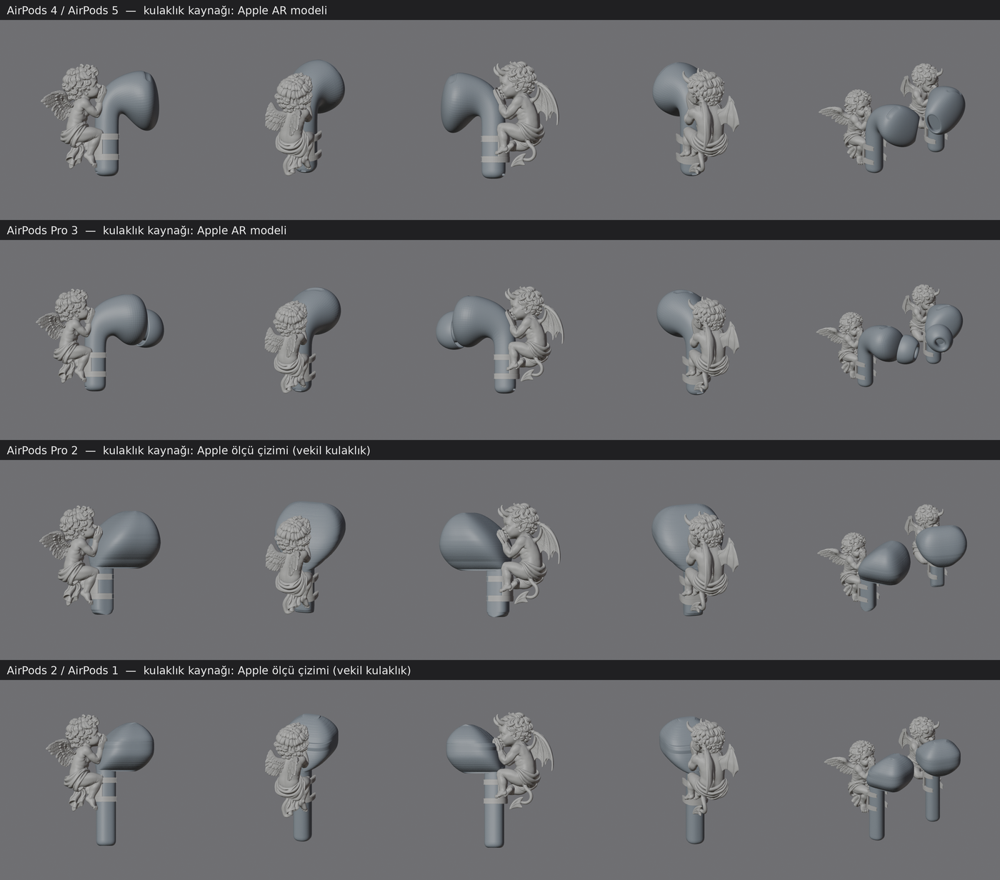

# AirPods melek ve şeytan figürleri

Melek **sağ**, şeytan **sol** kulaklığa takılır. Figür sapın arka tarafından yukarı tırmanmış durur, ellerini kulaklığın başına dayar. Sapı diz ve ayak hizasındaki iki C kelepçe sarar; avuçlar kulaklık başının arka yüzüne oturur. Figür kulaklığa arkadan, ileri doğru bastırılarak takılır; kelepçeler sapın üzerinden esneyip geçerek oturacak şekilde tasarlandı.

## Modeller

| Klasör | Uyduğu kulaklık | Figür boyu | Ağırlık (1,15 g/cm³) | Kulaklık geometrisinin kaynağı |
|---|---|---|---|---|
| `airpods45/` | AirPods 4, AirPods 5 | 30 mm | melek 1,67 g, şeytan 1,85 g | Apple'ın AR modeli (gerçek ölçekli 3B) |
| `airpodspro3/` | AirPods Pro 3 | 30 mm | 1,67 g / 1,86 g | Apple'ın AR modeli |
| `airpodspro2/` | AirPods Pro 2 (Lightning ve USB-C) | 30 mm | 1,67 g / 1,85 g | Apple ölçü çizimi, vekil kulaklık |
| `airpods2/` | AirPods 2, AirPods 1 | 32 mm | 2,01 g / 2,23 g | Apple ölçü çizimi, vekil kulaklık |

Apple'ın çizimine göre AirPods 4 ve AirPods 5'in gövdesi aynıdır. AirPods 3'ün gövdesi farklı olduğu için pakette yoktur, istenirse eklenir. Taklit AirPods'ların ölçüleri değiştiği için onlara uyum garanti değildir.

## Dosyalar (her model klasöründe)

- `baski/melek_sag.stl`, `baski/seytan_sol.stl`: basılacak figürler. Tablanın ortasında, en alt noktası Z=0'da, takıldığı duruşta dik durur.
- `baski/gecme_testi_sag.stl`: üç geçme test kuponu (aşağıya bakın).
- `montaj/`: figürler ve kulaklık aynı koordinatlarda. `kulaklik_*_referans.stl` yalnızca önizleme ve kontrol içindir, **basılmaz**.
- `onizleme.png`: soldan sağa: melek (yandan, arkadan), şeytan (yandan, arkadan), ikisi birlikte.
- `kontrol/`: ölçüler, ağırlık, kulaklıkla çakışma hacmi (hepsinde 0) ve kulaklığa yakın bölgedeki et kalınlığı ölçümleri.

STL birimi milimetredir. İçe aktarırken %100 ölçek kullanın.

## Baskıdan önce: geçme testi

1. Seçtiğiniz kulaklığın `gecme_testi_sag.stl` dosyasını, üretimde kullanacağınız reçine, pozlama, yıkama ve kürleme ayarlarıyla basın.
2. Kuponların arka bloğundaki çentik sayısı kupon numarasıdır. Kupon 1'de yan başına 0,08 mm, kupon 2'de 0,12 mm, kupon 3'te 0,16 mm boşluk vardır. **Figürler 0,12 mm ile hazırlandı.**
3. Kuponu sağ kulaklığın sapına arkadan bastırın. Doğru kupon zorlanmadan "tık" diye oturmalı, sallanmamalı ve sap bükülmeden çıkabilmelidir.
4. Kupon 2 uymuyorsa hangisinin uyduğunu bildirin; figürler o boşlukla yeniden üretilir (`scripts/build.py` içindeki `CLEAR` değeri).
5. Pro 2 ve AirPods 2 kulaklık şekilleri çizimden kurulduğu için bu iki modelde test özellikle önemlidir.

## Baskı notları

- **Reçine:** Kelepçeler takıp çıkarırken esner. Standart reçine bu esnemede çatlayabilir, bu yüzden tough, ABS-like veya esnekliği artırılmış bir karışım önerilir. Kelepçe et kalınlığı 1,1 mm, arkadaki bağlantı şeridi 1,0 mm'dir.
- **Yön:** Figürün sırtını (kanat tarafını) tablaya bakacak şekilde 30–45° eğik koyun. Destekleri sırta, kanatların arkasına ve örtünün altına verin.
- **Desteksiz kalması gereken yüzeyler:** Kelepçelerin iç yüzü, sap oluğu, avuçların kulaklığa oturan yüzü ve yüz. Bu yüzeylerdeki destek izi geçmeyi bozar.
- Kanat tüyleri ve saç kıvrımları bu boyutta yaklaşık 0,3–0,5 mm incelikte. Yıkama ve destek sökme sırasında dikkatli olun.
- Boya ve astar kelepçe içine ve avuç yüzeyine birikmemelidir. Bu yüzeyler boşluğu daraltır.

## Kullanım ve uyarılar

- **Şarj kutusu:** Figür takılıyken kulaklık kutuya girmez. Kutuya koymadan önce figür çıkarılır.
- **Anten ve sensör bölgesi:** Apple'ın aksesuar çizimlerinde AirPods 4/5, Pro 2 ve Pro 3'ün sapının tamamı, AirPods 2'de ise sapın arka yüzü taralı bölgedir: "Bu bölgelere giren aksesuarlar ürün performansını olumsuz etkiler." Figür bu bölgeyi sarar. Bluetooth menzilinde düşüş, aramada mikrofon kalitesinde değişim ve sap üzerindeki sıkma/dokunma kontrollerinde zorluk olabilir. Prototip bir telefon görüşmesi ve menzil denemesiyle sınanmalıdır.
- Sapın altındaki şarj kontakları ve hoparlör açık kalır. AirPods 2'de başın arka yüzündeki mikrofon deliği figüre yakındır.
- **Ağırlık ve kulağa oturma:** Figür 4–5,5 g'lık kulaklığa 1,7–2,2 g ekler. Gerçek bir kulak modeliyle deneme yapılmadı. Figürün kulak kepçesine değip değmediği ve kulaklığın yerinde kalıp kalmadığı prototipte görülmelidir.
- Başa bakan (içteki) kanat, kafaya değmemesi için kesildi. Dışarıdan görünen profil görsellerdeki gibidir.
- Fiziksel baskı ve takma denemesi yapılmadı. Sayısal kontroller (su geçirmezlik, kulaklıkla sıfır çakışma, et kalınlığı) baskı denemesinin yerine geçmez.

## Pro 2 ve AirPods 2 hakkında

Bu iki modelin Apple'da 3B dosyası artık yayında değil. Kulaklıklar Apple'ın ölçü çizimlerindeki ön ve yan siluetlerden kuruldu:

- Sap kesiti ölçüldü: Pro 2 5,6 × 6,4 mm, AirPods 2 5,9 × 6,4 mm.
- Kulaklık başı bilerek gerçeğinden biraz büyük tutuldu. Figürün elleri başa sürtmez ama aralarında küçük bir boşluk kalabilir.
- Kelepçeler bu ölçülere göre olduğu için geçme testi şarttır.
